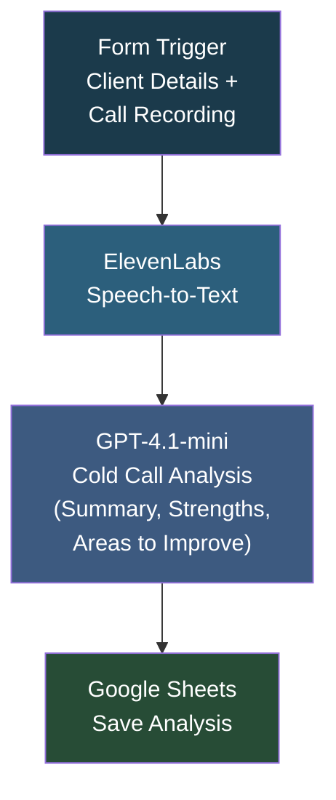

# Post Call Analysis

## Overview

A cold call coaching workflow for wealth advisory teams. A user submits a call recording along with client details through a form. The audio is transcribed using ElevenLabs' speech-to-text API, then GPT-4.1-mini analyzes the transcript as a veteran cold-calling coach, evaluating rapport building, value articulation, objection handling, tone, and pacing. The structured analysis (summary, strengths, areas to improve) is saved to a Google Sheet for team review. Built specifically for ShiftAltCap's HNI prospect conversations.

## How It Works

```
Form (client name, job title, company, call recording) -> ElevenLabs speech-to-text (transcribe) -> GPT-4.1-mini (analyze as cold-call coach) -> Google Sheets (save analysis)
```

### Workflow Diagram



## Integrations

- **ElevenLabs** - Speech-to-text transcription (Scribe v1)
- **OpenAI (GPT-4.1-mini)** - Cold call coaching analysis
- **Google Sheets** - Analysis results storage

## Setup

1. Import `Post_Call_analysis.json` into your n8n instance.
2. Configure OpenAI and Google Sheets credentials.
3. Update the ElevenLabs API key and Google Sheet document ID.
4. Activate and submit the form with a call recording.
